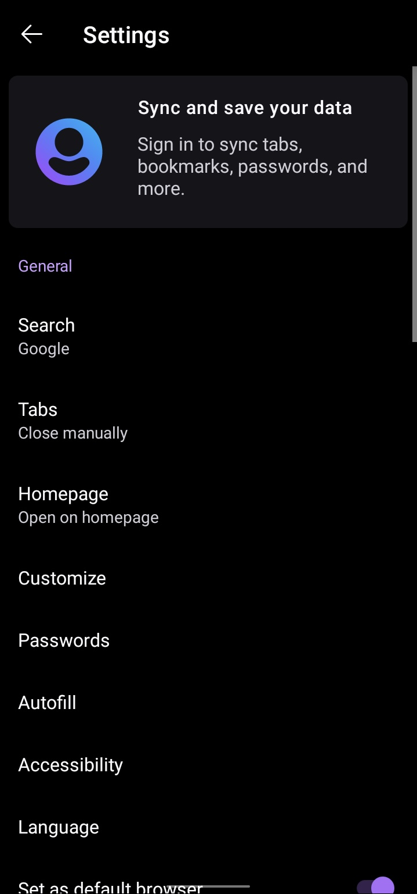

# AMOLED-Waterfox

This project provides automated AMOLED-patched builds of the official Waterfox Android browser. Since Waterfox (and its upstream forks) do not natively support true AMOLED black themes, this patch applies minor resource changes to improve dark mode for OLED displays.

Releases are built automatically when a new version of Waterfox Android is detected.

## Disclaimer

This project is not affiliated with or endorsed by Waterfox or its developers. All credits for the original application go to the Waterfox project.

## Why not build from source?

Rebuilding the entire browser just to change a few XML and CSS lines is inefficient. This method directly modifies the official APK and repackages it, preserving original functionality while applying UI-level changes.

## How it works

- Downloads the latest official Waterfox Android release (APK)  
- Decompiles it using apktool  
- Modifies a few dark mode resource values (XML, CSS, and smali)  
- Rebuilds and re-signs the APK  
- Publishes the signed APK automatically to GitHub Releases  

## Screenshots

Here’s how AMOLED-Waterfox looks in action:

  
  
  
  

## Usage

- Install manually from the [Releases](https://github.com/karanveers969/Waterfox-AMOLED/releases) page  
- Or add the repo to [Obtainium](https://github.com/ImranR98/Obtainium) for automatic update tracking  

## Security Notes

Only resource files are modified. No core app logic is touched.

Re-signing is required, so if you prefer full control:

- Fork the repo  
- Replace the signing keys via GitHub Actions secrets  
- Build your own trusted APK  

## Credits

This project was inspired by [Ironfox-OLEDDark](https://github.com/ArtikusHG/Ironfox-OLEDDark) by ArtikusHG. Many thanks to their clean approach and automation scripts.
